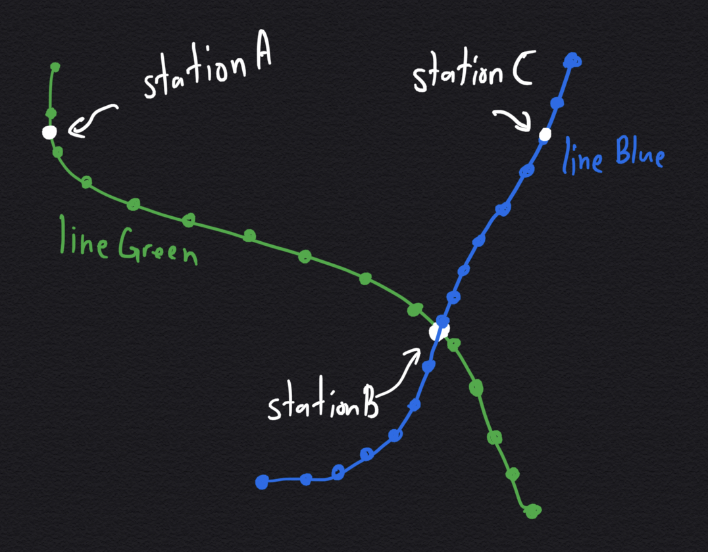

# Part 2 Moving between Station along Train track

ในการขยับกล้องระหว่างสถานีหนึ่งไปอีกสถานีหนึ่ง สมมติเราต้องการจะขยับจากสถานี `stationA` ไปสถานีปลายทางที่ `stationC`

ถ้าเราไม่ต้องการที่จะขยับระหว่างจุดของสถานี `stationA` ไป `stationC` เลย ในบางกรณีอาจจะต้องมีการเปลี่ยนสายระหว่างทางที่สถานี `stationB` เราจึงจะเก็บข้อมูลไว้ว่าต้องเดินทางอย่างไรในรูปแบบของ `Array` ที่มี `Object` ที่มี property ดังนี้

1. `from` : เก็บ id ของสถานีเริ่มต้น
2. `to` : เก็บ id ของสถานีปลายทาง
3. `line` : เก็บ id ของเส้นทางเดินรถระหว่าง 2 สถานีข้างต้น

```javascript
const routes = [
  {
    from: stationA,
    to: stationB,
    line: lineGreen,
  },
  {
    from: stationB,
    to: stationC,
    line: lineBlue,
  },
];
```



เราจะสร้างฟังก์ชั่นที่เปลี่ยนจาก `tracks` เป็น จุดบนเส้นทางรถไฟที่เชื่อมระหว่าง `stationA` กับ `stationC`

1. แปลง `from`, `to`, และ `line` ในแต่ละ `track` ให้เป็น coordinates

```javascript
// src/utils/nameToCoords.js
import flatten from '@turf/flatten';

export default function nameToCoords(directionsName, station, trainline) {
  /*
  [
    {
      from: Ari,
      to: Siam,
      line: 101
    }
  ]
  */
  const direction = directionsName.map((direction) => {
    const { from, to, line } = direction;

    const {
      geometry: { coordinates: fromCoord },
    } = station.features.find(({ properties: { code } }) => code === from);
    const {
      geometry: { coordinates: toCoord },
    } = station.features.find(({ properties: { code } }) => code === to);
    const {
      features: [
        {
          geometry: { coordinates: lineCoord },
        },
      ],
    } = flatten(
      trainline.features.find(({ properties: { id } }) => id === line)
    );

    return { from: fromCoord, to: toCoord, line: lineCoord };
  });

  return direction;
}
```

2. สร้างฟังก์ชั่นเพื่อแปลง `track` ให้กลายเป็นเส้นทางด้วยขั้นตอนตอนไปนี้

   1. หา index (`indexA`) ที่ใกล้ที่สุดของสถานี `from` กับจุดต่างๆ ใน `line`
   2. หา index (`indexB`) ที่ใกล้ที่สุดของสถานี `to` กับจุดต่างๆ ใน `line`
   3. คืน `Array` ที่เป็นจุดระหว่าง `indexA` และ `indexB`

3. รวม `path` ที่ได้มาจาก แต่ละ `track` เป็นเส้นเดียวกันด้วย `Array.reduce`

```javascript
// src/utils/findPathBetweenStation.js
import findNearestIdx from './findNearestIdx';
import nameToCoords from './nameToCoords';

export default (station, line) =>
  function findPathBetweenStation(directions) {
    /*
  directions = [
    {
      from: [lat, lon], of Ari Station
      to: [lat, lon], of Siam Station
      line: [[lat, lon], ...] (geometry of BTS Green)
    },
    {
      from: Siam,
      to: Silom,
      line: [[lat, lon], ...]
    },
  ]
  */
    const d = nameToCoords(directions, station, line);
    const paths = d.reduce((paths, direction) => {
      const { from, to, line } = direction;

      const fromIdx = findNearestIdx(from, line),
        toIdx = findNearestIdx(to, line);

      let path = line.slice(fromIdx, toIdx);

      if (fromIdx > toIdx) {
        const flip = [...line].reverse();
        path = flip.slice(line.length - fromIdx, line.length - toIdx);
      }
      path[0] = from;
      path[path.length - 1] = to;

      return [...paths, ...path];
    }, []);

    return paths;
  };
```

ในส่วนของการขยับกล้องของ mapbox จะใช้ฟังก์ชั่น `panTo` ซึ่งจะสามารถขยับกล้องได้แค่จากจุดหนึ่งไปอีกจุดหนึ่งเท่านั้นใน 1 eventloop แต่เนื่องจากเราต้องการขยับตามเส้นทางเดินรถ ซึ่งจำนวนครั้งในการเรียกฟังก์ชั่นจะขึ้นอยู่กับจำนวนจุดในเส้นทางเดินรถระหว่างสถานีสองสถานี
